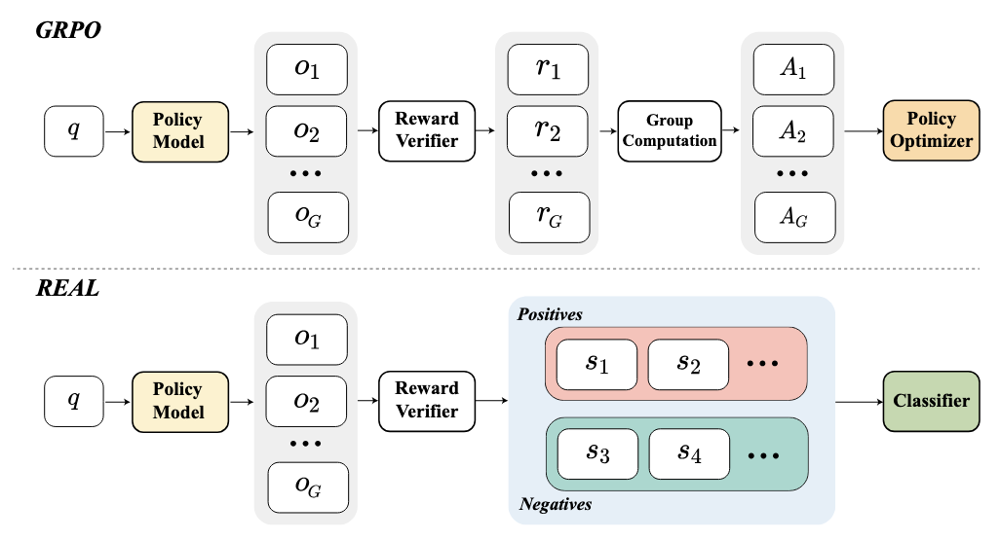
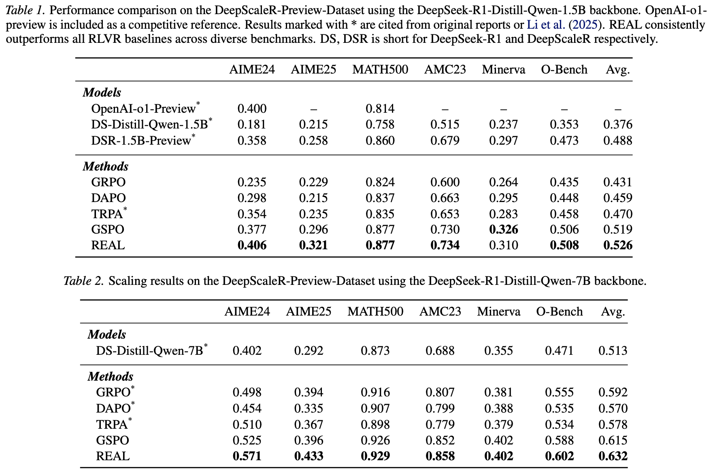
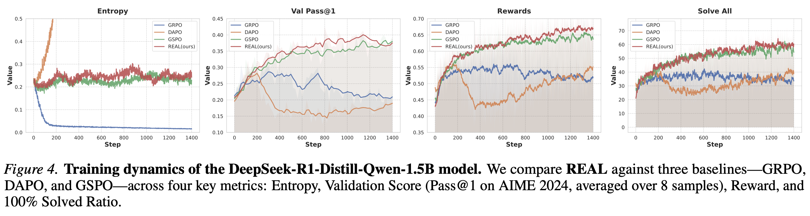
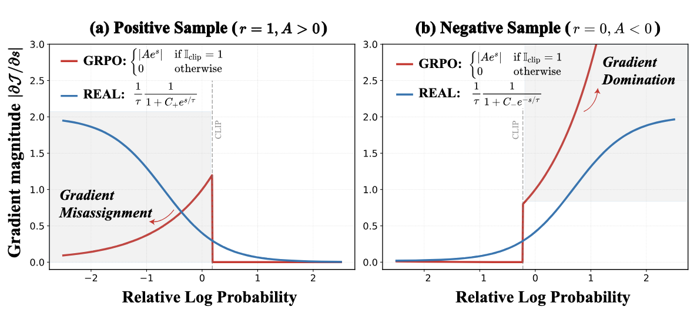

# Rewards as Labels: Revisiting RLVR from a Classification Perspective

<div align="left">

[](https://arxiv.org/abs/2602.05630)
[](https://opensource.org/licenses/MIT) 
[](https://www.python.org/downloads/release/python-3100/) 

## 🔥 Latest News

- **[2026.02]** Our paper is now available on arXiv! Check it out at [arXiv:2602.05630](https://arxiv.org/abs/2602.05630)

## 📢 Overview

**REAL (Rewards as Labels)** is a novel framework for Reinforcement Learning with Verifiable Rewards (RLVR) that reformulates policy optimization as a classification problem. By treating verifiable rewards as categorical labels rather than scalar weights, REAL addresses fundamental **gradient mismatches** in existing GRPO-style methods and achieves superior training stability and performance on mathematical reasoning tasks.

<p align="center">
  
  <br>
  <em>Figure: Overview of our REAL framework</em>
</p>

### Key Highlights

- 🎯 **Identifies Critical Issues**: Reveals *Gradient Misassignment in Positives* and *Gradient Domination in Negatives* in GRPO-style methods
- 🔄 **Novel Perspective**: Reformulates RLVR as classification by treating rewards as categorical labels
- 📈 **State-of-the-Art Performance**: 
  - **+6.7%** over DAPO on 1.5B models
  - **+6.2%** over DAPO and **+1.7%** over GSPO on 7B models
- 🛡️ **Superior Stability**: Maintains stable training without entropy collapse or explosion

<p align="center">
  
  <br>
  <em>Figure: Performance comparison on the DeepScaleR-Preview-Dataset using the DeepSeek-R1-Distill-Qwen-1.5B / 7B backbone</em>
</p>

<p align="center">

<br>
<em>Figure: Training dynamics comparison - REAL maintains stable entropy and achieves consistent improvement</em>
</p>

---

## 🔍 Method

REAL reformulates policy optimization by treating verifiable rewards ($r \in \{0,1\}$) as categorical labels, enabling a natural classification objective:

$$
\mathcal{L}_{\text{REAL}} = \log \left( 1 + \sum_{\mathcal{O}_+} e^{-\bar{s}^i/\tau} \right) + \log \left( 1 + \sum_{\mathcal{O}_-} e^{\bar{s}^j/\tau} \right)
$$

where $\bar{s}$ is the length-normalized relative log-probability and $\tau$ is the temperature parameter.

### Why REAL Works

REAL induces **monotonic and bounded** gradient weighting with magnitude upper-bounded by $\frac{1}{\tau}$:

$$
|\mathcal{W}_{\text{REAL}}| = 
\begin{cases}
\frac{1}{\tau}\frac{1}{1 + C_+ e^{\bar{s}^k / \tau}}, & r = 1 \\
\frac{1}{\tau}\frac{1}{1 + C_- e^{-\bar{s}^k / \tau}}, & r = 0
\end{cases}
$$

This effectively mitigates gradient issues in GRPO while ensuring stable optimization.

<p align="center">
  
  <br>
  <em>Figure: Gradient magnitude comparison - REAL provides monotonic and bounded gradients</em>
</p>

---

## 🔧 Installation

```bash
git clone https://github.com/Red-RL/REAL.git
cd REAL
conda create -n real python=3.10
conda activate real
bash scripts/install.sh
```

## 🚀 Training
Before executing the training script, make sure to modify your model path and wandb API key according to your local environment and account configuration.

```bash
bash scripts/train/1.5b_real.sh
```

**Modification Instructions**
1. To switch to the DeepSeek-R1-Distill-Qwen-7B or other models, replace the value of the MODEL_PATH variable in the script with the actual storage path of the 7B model.

```bash
MODEL_PATH="path/to/DeepSeek-R1-Distill-Qwen-7B"
```

2. To use the DAPO-17k-Math dataset, replace the data.train_files path in the script from ./datasets/deepscaler/data/train.parquet to ./datasets/dapo17k/data/dapo-math-17k.parquet.
```bash
# Original dataset path
--data.train_files=./datasets/deepscaler/data/train.parquet \

# Modified path for DAPO-17k-Math dataset
--data.train_files=./datasets/dapo17k/data/dapo-math-17k.parquet \
```

## 🚀 Evaluation

This evaluation script supports datasets: aime, aime25, math, amc, minerva, olympiad_bench. Modify EXP_NAMES and STEPS in the script to match your setup—they must have the same number of elements with one-to-one correspondence, as these variables are used to locate model checkpoints.

```bash
bash scripts/eval/run_eval.sh
```


## 📖 Citation
If you find our work helpful for your research, please consider citing:

```bibtex
@article{zhai2026real,
  title={Rewards as Labels: Revisiting RLVR from a Classification Perspective},
  author={Zhai, Zepeng and Chen, Meilin and Zhao, Jiaxuan and Qian, Junlang and Shen, Lei and Lu, Yuan},
  journal={arXiv preprint arXiv:2602.05630},
  year={2026}
}
```